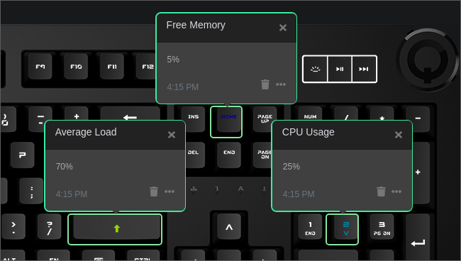

# Q Applet: Mini-Meters

Displays the CPU usage, free memory, and average load on individual keys on a Das Keyboard Q Series.

[GitHub repository]([https://github.com/daskeyboard/q-applet-cpu-usage](https://github.com/corykim/daskeyboard-applet--mini-meters))

## Example

All three meters enabled on three separate keys.

## Changelog

[CHANGELOG.MD](CHANGELOG.md)

## Installation

Requires a Das Keyboard Q series: www.daskeyboard.com

Installation, configuration and uninstallation of applets is done within
the Q Desktop application (https://www.daskeyboard.com/q)

## Running tests

- `yarn test`

## Contributions

Pull requests welcome.

## Copyright / License

Copyright 2019 Cory Kim

Permission is hereby granted, free of charge, to any person obtaining a copy of this software and associated documentation files (the "Software"), to deal in the Software without restriction, including without limitation the rights to use, copy, modify, merge, publish, distribute, sublicense, and/or sell copies of the Software, and to permit persons to whom the Software is furnished to do so, subject to the following conditions:

The above copyright notice and this permission notice shall be included in all copies or substantial portions of the Software.

THE SOFTWARE IS PROVIDED "AS IS", WITHOUT WARRANTY OF ANY KIND, EXPRESS OR IMPLIED, INCLUDING BUT NOT LIMITED TO THE WARRANTIES OF MERCHANTABILITY, FITNESS FOR A PARTICULAR PURPOSE AND NONINFRINGEMENT. IN NO EVENT SHALL THE AUTHORS OR COPYRIGHT HOLDERS BE LIABLE FOR ANY CLAIM, DAMAGES OR OTHER LIABILITY, WHETHER IN AN ACTION OF CONTRACT, TORT OR OTHERWISE, ARISING FROM, OUT OF OR IN CONNECTION WITH THE SOFTWARE OR THE USE OR OTHER DEALINGS IN THE SOFTWARE.

Application Icon made by Freepik from www.flaticon.com
